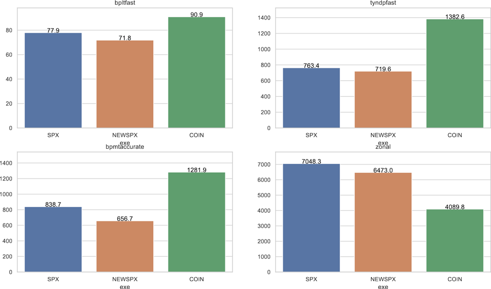
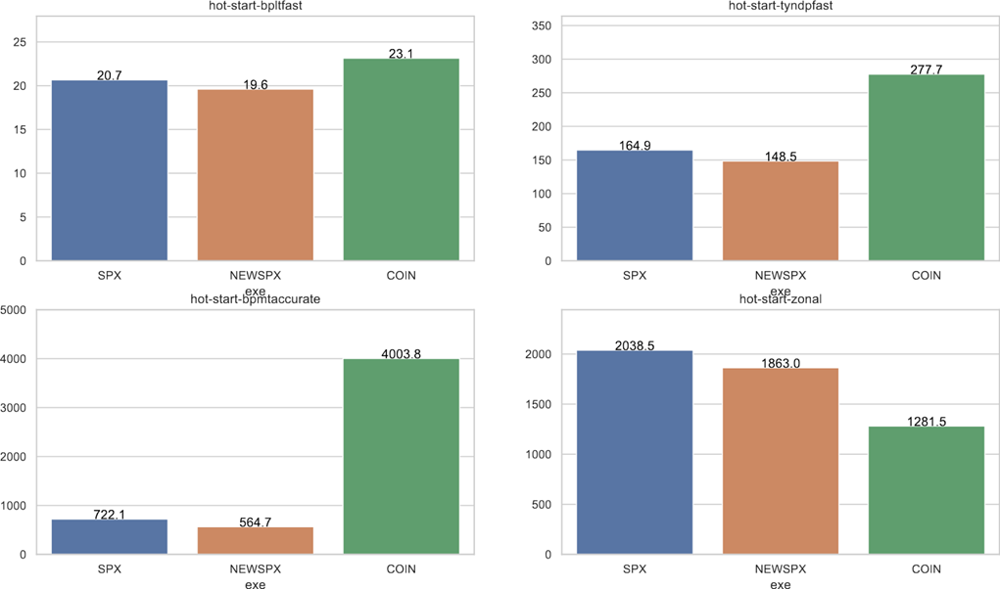

# Sirius solver 

## Table of Contents

* [About Sirius](#about-sirius)
* [RTE's Industrial use cases](#industrial-use-cases)
* [How to build and use Sirius](#integration)
  * [cmake configuration scripts](#cmake-configuration-scripts)
  * [OR-Tools](#or-tools)
  * [Standalone API](#standalone-api)

## About Sirius

Sirius has been developed by [RTE](https://www.rte-france.com/) and published as an open-source solver which license is Apache 2.0. The Sirius solver is a C implementation of the dual simplex algorithm (for continuous problems) and the branch-and-bound algorithm (problems with binary variables). The tool can be used as a standalone C library or through a fork of [OR-Tools](https://github.com/google/or-tools), Google's software suite for combinatorial optimization.  

## RTE's Industrial use cases

At the beginning, Sirius is an integral part of the [Antares Simulator](https://antares-simulator.org/) software, an adequacy tool, designed and used by RTE, the French transmission system operator. Antares is used to assess the security of energy supply by simulating the electrical mix decided during the optimization. The simulation of a year consists in solving 104 hourly discretized problems (2 per week). 

In the following, computational results using Sirius and the Coin-OR CLP software are presented, they are based on problems coming from different RTE's studies, leading to smaller or bigger optimization problems. The optimization problem is a flow in a network describing the power systems for which the security of energy supply is to be assessed. For example, long-term European studies where each country is a node leads to 15K rows, 53K columns and 102K elements in the constraint matrix. Another example is medium-term French studies where each French region is a node leads to 56K rows, 134K columns and 291K elements in the constraint matrix.


Since only some coefficients in the objective and the bounds of the constraints change between the problems, a hotstart mechanism can be used in some cases to improve the performance of the resolution of the 104 problems, it significantly improves the performance of the simplex algorithm as illustrated in the following results :



## How to build and use Sirius

### cmake configuration scripts

Please refer to the command detailed in [Sirius solver INSTALL.md](INSTALL.md) in order to compile and integrate the Sirius distribution in any cmake project using suitable find_package procedure.

### OR-Tools

OR-Tools allow to use Sirius solver in a variety of programming languages such as C++, C#, Python and Java. More details on [OR-Tools](https://github.com/google/or-tools).

This fork is available on github here: [OR-Tools with Sirius](https://github.com/rte-france/or-tools/tree/unification_2020)

Sirius can be used through OR-Tools like any other solver (see OR-Tools [Quick start](https://developers.google.com/optimization/introduction/get_started) and more in depth [Documentation](https://developers.google.com/optimization/)).  
And then for instance in C++, you can specify that you want to use Sirius as a solver by using ```MPSolver::SIRIUS_LINEAR_PROGRAMMING``` or ```MPSolver::SIRIUS_MIXED_INTEGER_PROGRAMMING```.

### Standalone C API

Sirius can also be used as a standalone solver for linear problems with continuous variables or binary variables. The API is described here [Work in progress - SiriusAPI.md](SiriusAPI.md)